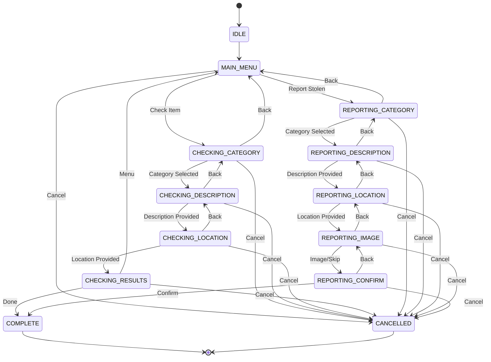

# Conversation State Machine

This document describes the conversation state machine for the WhatsApp bot.

## States

### Initial States

- **IDLE**: Initial state when a new conversation starts
- **MAIN_MENU**: User is presented with main menu options (Check or Report)

### Check Item Flow

- **CHECKING_CATEGORY**: User selects item category (bicycle, phone, etc.)
- **CHECKING_DESCRIPTION**: User provides item description
- **CHECKING_LOCATION**: User provides location for search radius
- **CHECKING_RESULTS**: System displays matching items

### Report Item Flow

- **REPORTING_CATEGORY**: User selects stolen item category
- **REPORTING_DESCRIPTION**: User describes the stolen item
- **REPORTING_LOCATION**: User provides theft location
- **REPORTING_IMAGE**: User uploads item photo (optional)
- **REPORTING_CONFIRM**: User confirms report before submission

### Terminal States

- **COMPLETE**: Conversation completed successfully
- **CANCELLED**: User cancelled the conversation

## State Transitions

### From IDLE

```text
IDLE → MAIN_MENU
```

### From MAIN_MENU

```text
MAIN_MENU → CHECKING_CATEGORY (user selects "Check Item")
MAIN_MENU → REPORTING_CATEGORY (user selects "Report Stolen")
MAIN_MENU → CANCELLED (user types "cancel")
```

### Check Item Flow Transitions

```text
CHECKING_CATEGORY → CHECKING_DESCRIPTION (category selected)
CHECKING_CATEGORY → MAIN_MENU (user types "back")
CHECKING_CATEGORY → CANCELLED (user types "cancel")

CHECKING_DESCRIPTION → CHECKING_LOCATION (description provided)
CHECKING_DESCRIPTION → CHECKING_CATEGORY (user types "back")
CHECKING_DESCRIPTION → CANCELLED (user types "cancel")

CHECKING_LOCATION → CHECKING_RESULTS (location provided)
CHECKING_LOCATION → CHECKING_DESCRIPTION (user types "back")
CHECKING_LOCATION → CANCELLED (user types "cancel")

CHECKING_RESULTS → MAIN_MENU (user types "menu")
CHECKING_RESULTS → COMPLETE (user types "done")
CHECKING_RESULTS → CANCELLED (user types "cancel")
```

### Report Item Flow Transitions

```text
REPORTING_CATEGORY → REPORTING_DESCRIPTION (category selected)
REPORTING_CATEGORY → MAIN_MENU (user types "back")
REPORTING_CATEGORY → CANCELLED (user types "cancel")

REPORTING_DESCRIPTION → REPORTING_LOCATION (description provided)
REPORTING_DESCRIPTION → REPORTING_CATEGORY (user types "back")
REPORTING_DESCRIPTION → CANCELLED (user types "cancel")

REPORTING_LOCATION → REPORTING_IMAGE (location provided)
REPORTING_LOCATION → REPORTING_DESCRIPTION (user types "back")
REPORTING_LOCATION → CANCELLED (user types "cancel")

REPORTING_IMAGE → REPORTING_CONFIRM (image uploaded or skipped)
REPORTING_IMAGE → REPORTING_LOCATION (user types "back")
REPORTING_IMAGE → CANCELLED (user types "cancel")

REPORTING_CONFIRM → COMPLETE (user confirms)
REPORTING_CONFIRM → REPORTING_IMAGE (user types "back" to edit)
REPORTING_CONFIRM → CANCELLED (user types "cancel")
```

### Terminal States

```text
COMPLETE → (no transitions, conversation ends)
CANCELLED → (no transitions, conversation ends)
```

## State Diagram (Mermaid)



## Conversation Context

Each conversation maintains:

- **phone_number**: User's phone number (unique identifier)
- **state**: Current conversation state
- **data**: Dictionary of collected data (category, description, location, etc.)
- **created_at**: When conversation started
- **updated_at**: Last state transition

## Storage

- **Backend**: Redis
- **TTL**: 1 hour (3600 seconds) - configurable
- **Key Format**: `conversation:{phone_number}`
- **Serialization**: JSON

## Navigation Commands

Users can navigate using these commands at most states:

- **"cancel"**: Cancel conversation and return to IDLE
- **"back"**: Return to previous state
- **"menu"**: Return to MAIN_MENU
- **"done"**: Complete conversation

## Implementation

See source files:

- [`src/presentation/bot/states.py`](../src/presentation/bot/states.py) - State definitions and transitions
- [`src/presentation/bot/context.py`](../src/presentation/bot/context.py) - Conversation context
- [`src/presentation/bot/storage.py`](../src/presentation/bot/storage.py) - Redis storage
- [`src/presentation/bot/state_machine.py`](../src/presentation/bot/state_machine.py) - State machine logic
